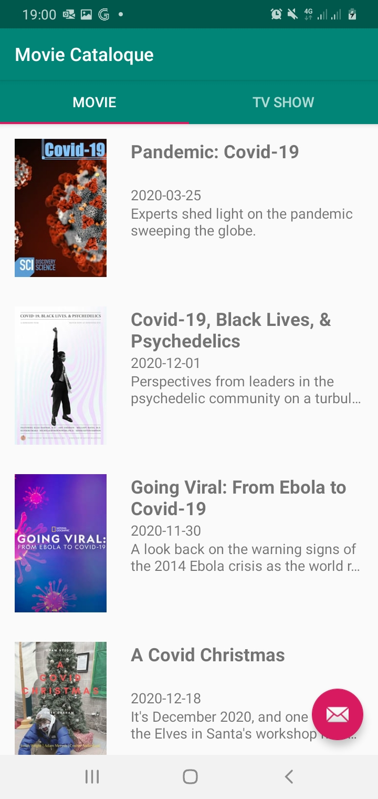

This is improvement movie application to include tv show and feature such as languange, notification, search and create another application (only show favorite movies) that is connected to the main application using content provider

For example we would like to search "Covid" movie and put in favorite:

